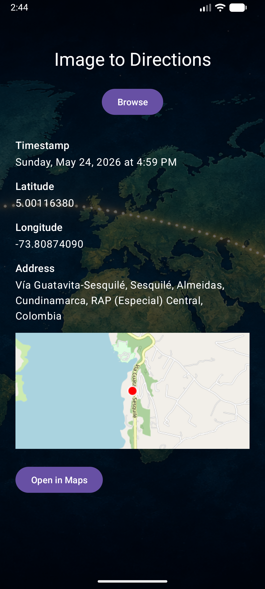
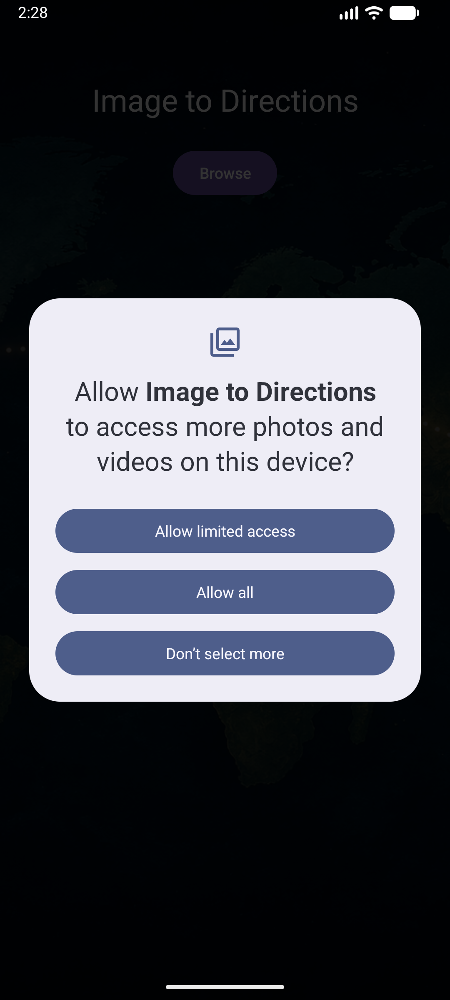

# Image to Directions

Kotlin Android app that reads JPEG EXIF metadata. Open a photo from the app or receive one from another app’s share sheet to view its capture time, GPS coordinates, reverse-geocoded address, and a map preview—then open the location in a maps app.

**Version:** 1.2.0 · **minSdk** 24 · **targetSdk** 35



## Features

- Title screen with a **Browse** button (always available to pick another image)
- JPEG image picker via the system document picker
- **Share to app** — receive a single JPEG from another app’s share sheet (`ACTION_SEND`)
- EXIF timestamp formatted for reading (e.g. `Sunday, May 24, 2026 at 4:59 PM`)
- GPS latitude and longitude with 8 decimal places
- **Reverse-geocoded address** via [Nominatim](https://nominatim.openstreetmap.org/) (OpenStreetMap)
- Tap the address to **copy it to the clipboard**
- **Map thumbnail** composed from OpenStreetMap tiles; tap to open the image in an external viewer
- **Open in Maps** button launches a `geo:` intent when GPS data is present
- No-GPS message when coordinates are missing
- Earth background on the title screen

## Permissions

| Permission | Purpose |
|------------|---------|
| `INTERNET` | Download map tiles and reverse-geocoding results |
| `ACCESS_MEDIA_LOCATION` | Read GPS EXIF from photos served through MediaStore (required on Android 10+ for shared images) |

When you share or open a photo that stores location in EXIF, Android may prompt for access to photo location. Allow it so GPS coordinates can be read from shared gallery images.



Shared images must be **JPEG** (`image/jpeg`). Other image types are rejected with an error that includes the received MIME type.

## Requirements

- Android SDK (API 35 recommended)
- JDK 17+

Set `ANDROID_HOME` to your Android SDK path, for example:

```bash
export ANDROID_HOME=$HOME/Android/Sdk
```

## Build

From the project root:

```bash
./gradlew assembleDebug
```

Install on a connected device or emulator:

```bash
./gradlew installDebug
```

Run unit tests:

```bash
./gradlew testDebugUnitTest
```

## Project structure

```
app/src/
  main/kotlin/com/randomingenuity/image_to_directions/
    ui/MainActivity.kt                    # Screen, picker, share handling, clipboard
    exif/ExifMetadataReader.kt            # EXIF timestamp and GPS extraction
    exif/ExifContentUriOpener.kt          # MediaStore setRequireOriginal URI access
    exif/ExifTimestampFormatter.kt          # Human-readable capture time
    exif/GpsCoordinateParser.kt           # GPS rational-to-decimal conversion
    exif/GpsCoordinateFormatter.kt        # Coordinate display formatting
    exif/ImageMetadata.kt                 # Parsed metadata model
    exif/MediaLocationPermissionHelper.kt # ACCESS_MEDIA_LOCATION checks
    geocode/ReverseGeocoder.kt            # Nominatim reverse geocoding
    geocode/NominatimAddressParser.kt     # Address JSON parsing
    map/LocationMapThumbnailLoader.kt     # OSM tile map thumbnail
    map/OpenStreetMapTileMath.kt          # Web Mercator tile math
    share/ShareIntentHandler.kt           # ACTION_SEND URI and MIME handling
  main/res/                               # Layouts, drawables, strings, themes
  test/kotlin/com/randomingenuity/image_to_directions/
    exif/                                 # EXIF parsing and formatting tests
    geocode/                              # Nominatim response parsing tests
    map/                                  # Tile math tests
    share/                                # Share intent MIME resolution tests
  test/resources/                         # Sample JPEG fixtures with/without EXIF
asset/document/                           # Screenshots and sample images for docs
```

## How it works

### Browse

1. The user taps **Browse** and selects a JPEG.
2. On Android 10+, the app requests `ACCESS_MEDIA_LOCATION` when needed.
3. The app copies the original bytes to cache via a file descriptor (`ExifContentUriOpener` uses `MediaStore.setRequireOriginal()` when available).
4. `ExifMetadataReader` reads `DateTimeOriginal`/`DateTime` and GPS tags with AndroidX ExifInterface, with URI fallback when the cache copy lacks GPS.
5. GPS rationals are parsed for full precision; bogus `0,0` coordinates are rejected.
6. When GPS is valid, the app reverse-geocodes the coordinates, downloads OSM tiles for a map thumbnail, and shows **Open in Maps**.

### Share

1. Another app shares a JPEG to **Image to Directions** via the system share sheet.
2. `ShareIntentHandler` validates the intent MIME type (accepts `image/jpeg` and `image/*`, with JPEG file-signature fallback).
3. The shared `content://` URI is read with the same EXIF pipeline as browse, keeping the share intent alive until processing finishes.
4. Results are displayed on the same screen; **Browse** remains available.

## Testing

Use JPEG photos taken with a phone camera (they usually include EXIF timestamps; GPS only if location was enabled when the photo was taken).

Unit tests cover EXIF parsing, coordinate formatting, geocoding response parsing, tile math, and share MIME resolution using fixtures in `app/src/test/resources/`.

A documented example photo with GPS lives at `asset/document/20260524_165957.jpg` (Sesquilé, Colombia — matches the main screenshot).
